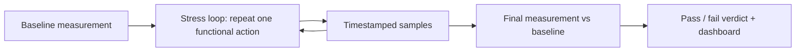

# Network Testing Research

Research notes and briefings on networking and network device testing.

I'm a telecommunications engineer with a network and security validation / QA automation background. I keep this repo as a working library: when I dig into a tool, a standard, or a vendor release, I write down what it does, how it works, and what I'd check before relying on it. Everything here is meant to be skimmed in five minutes or read in depth.

## Contents

| Topic | What's inside | Start here |
|-------|---------------|------------|
| [`qacafe/`](qacafe/) | QA Cafe tooling: CDRouter, CloudShark, Packet Viewer | [Fall 2026 briefing (PDF)](qacafe/QA_Cafe_Fall_2026_Research_Briefing.pdf) |

More topics will get their own folder, one per subject, so the repo stays easy to navigate.

## Featured: QA Cafe Fall 2026 briefing

A 7-page briefing built from QA Cafe's Fall 2026 newsletter and cross-checked against the vendor's product documentation, support guides, and press releases. It covers three things worth knowing as a test engineer.

### 1. Soak testing for broadband gateways (CDRouter Stability & Memory)

Functional and performance tests tell you whether a CPE works *now*. Stability tests ask whether it keeps working after hours or days under load, which is where memory leaks, CPU creep, and resource exhaustion show up.



Design points I found worth noting:

- **Three families of tests:** connectivity cycling (WAN, LAN, PPPoE, Wi-Fi association), throughput stability, and memory stability.
- **Throughput is judged against the device's own baseline** (default: fail below 90% of baseline), so no expected rate has to be configured per device.
- **Memory is judged as an absolute value** (default: fail above 80% utilization), which means devices that normally idle high need a tuned threshold.
- **Memory is read through standards, not an agent:** TR-181 `Device.DeviceInfo.MemoryStatus` over USP (TR-369) or CWMP (TR-069), so nothing custom has to run on the device under test.
- **Run length** ranges from one minute to one week; the default is one hour per test, so a full package can take days.
- **Prerequisites:** the Performance expansion and an NTA1000v5 or newer test system.

### 2. SmartFilter in Packet Viewer

SmartFilter turns a plain-English question into a validated Wireshark display filter. The architecture is the interesting part:

- Packet Viewer ships **no model, provider, or API key**. The operator exposes an HTTP endpoint and Packet Viewer posts the query to it.
- If the input is already a valid display filter, it is applied directly and the webhook is never called.
- Every candidate filter is **validated against Wireshark**, with **one retry** that passes back the rejected filter and the error.
- Credentials stay server-side and the model can be swapped without touching the UI.
- Status: documented as **experimental**.

### 3. Wi-Fi 7 validation

QA Cafe added an Advanced Wi-Fi 7 Module to CDRouter in July 2026. The briefing summarizes the vendor's position that Wi-Fi 7 qualification is more than radio throughput: connectivity across 2.4/5/6 GHz, security modes, Multi-Link Operation, multi-client behavior, and stability under sustained load.

## How I write these

- **Primary sources first:** vendor docs, support guides, standards, and press releases, with a numbered source list in each briefing.
- **Paraphrased, not copied:** summaries are in my own words; vendor material stays on the vendor's site and is linked, not mirrored.
- **Facts separated from opinion:** what a source states is cited; my own observations are labeled as such.
- **Gaps stated plainly:** if I couldn't verify something (a webinar recording, a paywalled case study), the briefing says so.

## Repository layout

```
network-testing-research/
├── README.md
└── qacafe/
    └── QA_Cafe_Fall_2026_Research_Briefing.pdf
```

## Disclaimer

This is an independent, personal project. It is not affiliated with, endorsed by, or an official document of QA Cafe or any other vendor mentioned. Product names and trademarks belong to their owners. Product details change, so check the vendor's current documentation before making decisions.

## Contact

Seif Tlijani, [GitHub](https://github.com/Seifeddin-tlijani). Corrections and suggestions are welcome through issues.
